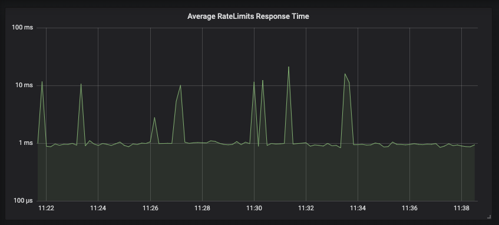

<h2 align="center">
    <br />
    Distributed RateLimiting Service
</h2>

# Gubernator
Gubernator is a distributed, high performance, cloud native and stateless rate-limiting service.

#### Features
* Gubernator evenly distributes rate limit requests across the entire cluster,
  which means you can scale the system by simply adding more nodes. 
* Gubernator doesn’t rely on external caches like memcached or redis, as such
  there is no deployment synchronization with a dependant service. This makes
  dynamically growing or shrinking the cluster in an orchestration system like
  kubernetes or nomad trivial.
* Gubernator holds no state on disk, It’s configuration is passed to it by the
  client on a per-request basis.
* Gubernator provides both GRPC and HTTP access to the API.
* It Can be run as a sidecar to services that need rate limiting or as a separate service.
* It Can be used as a library to implement a domain-specific rate limiting service.
* Supports optional eventually consistent rate limit distribution for extremely
  high throughput environments. (See GLOBAL behavior [architecture.md](docs/architecture.md))
* Gubernator is the english pronunciation of governor in Russian, also it sounds cool.

### Stateless configuration
Gubernator is stateless in that it doesn’t require disk space to operate. No
configuration or cache data is ever synced to disk. This is because every
request to gubernator includes the config for the rate limit. At first you
might think this an unnecessary overhead to each request. However, In reality a
rate limit config is made up of only 4, 64bit integers.

### Quick Start
```bash
# Download the docker-compose file
$ curl -O https://raw.githubusercontent.com/mailgun/gubernator/master/docker-compose.yaml
# Run the docker container
$ docker-compose up -d
```
Now you can make rate limit requests via CURL
```
# Hit the HTTP API at localhost:9080 (GRPC is at 9081)
$ curl http://localhost:9080/v1/HealthCheck

# Make a rate limit request
$ curl http://localhost:9080/v1/GetRateLimits \
  --header 'Content-Type: application/json' \
  --data '{
    "requests": [
        {
            "name": "requests_per_sec",
            "uniqueKey": "account:12345",
            "hits": "1",
            "limit": "10",
            "duration": "1000"
        }
    ]
}'
```

### ProtoBuf Structure

An example rate limit request sent via GRPC might look like the following
```yaml
rate_limits:
    # Scopes the request to a specific rate limit
  - name: requests_per_sec
    # A unique_key that identifies this instance of a rate limit request
    unique_key: account_id=123|source_ip=172.0.0.1
    # The number of hits we are requesting
    hits: 1
    # The total number of requests allowed for this rate limit
    limit: 100
    # The duration of the rate limit in milliseconds
    duration: 1000
    # The algorithm used to calculate the rate limit  
    # 0 = Token Bucket
    # 1 = Leaky Bucket
    algorithm: 0
    # The behavior of the rate limit in gubernator.
    # 0 = BATCHING (Enables batching of requests to peers)
    # 1 = NO_BATCHING (Disables batching)
    # 2 = GLOBAL (Enable global caching for this rate limit)
    behavior: 0
```

An example response would be

```yaml
rate_limits:
    # The status of the rate limit.  OK = 0, OVER_LIMIT = 1
  - status: 0,
    # The current configured limit
    limit: 10,
    # The number of requests remaining
    remaining: 7,
    # A unix timestamp in milliseconds of when the bucket will reset, or if 
    # OVER_LIMIT is set it is the time at which the rate limit will no 
    # longer return OVER_LIMIT.
    reset_time: 1551309219226,
    # Additional metadata about the request the client might find useful
    metadata:
      # This is the name of the coordinator that rate limited this request
      "owner": "api-n03.staging.us-east-1.mailgun.org:9041"
```

### Rate limit Algorithm
Gubernator currently supports 2 rate limit algorithms.

1. **Token Bucket** implementation starts with an empty bucket, then each `Hit`
   adds a token to the bucket until the bucket is full. Once the bucket is
   full, requests will return `OVER_LIMIT` until the `reset_time` is reached at
   which point the bucket is emptied and requests will return `UNDER_LIMIT`.
   This algorithm is useful for enforcing very bursty limits. (IE: Applications
   where a single request can add more than 1 `hit` to the bucket; or non network
   based queuing systems.) The downside to this implementation is that once you
   have hit the limit no more requests are allowed until the configured rate
   limit duration resets the bucket to zero.

2. [Leaky Bucket](https://en.wikipedia.org/wiki/Leaky_bucket) is implemented
   similarly to **Token Bucket** where `OVER_LIMIT` is returned when the bucket
   is full. However tokens leak from the bucket at a consistent rate which is
   calculated as `duration / limit`. This algorithm is useful for metering, as
   the bucket leaks allowing traffic to continue without the need to wait for
   the configured rate limit duration to reset the bucket to zero.

### Performance
In our production environment, for every request to our API we send 2 rate
limit requests to gubernator for rate limit evaluation, one to rate the HTTP
request and the other is to rate the number of recipients a user can send an
email too within the specific duration. Under this setup a single gubernator
node fields over 2,000 requests a second with most batched responses returned
in under 1 millisecond.


Peer requests forwarded to owning nodes typically respond in under 30 microseconds. 



NOTE The above graphs only report the slowest request within the 1 second sample time.
 So you are seeing the slowest requests that gubernator fields to clients.

Gubernator allows users to choose non-batching behavior which would further
reduce latency for client rate limit requests. However because of throughput
requirements our production environment uses Behaviour=BATCHING with the
default 500 microsecond window. In production we have observed batch sizes of
1,000 during peak API usage. Other users who don’t have the same high traffic
demands could disable batching and would see lower latencies but at the cost of
throughput.

## Gregorian Behavior
Users may choose a behavior called `DURATION_IS_GREGORIAN` which changes the 
behavior of the `Duration` field. When `Behavior` is set to `DURATION_IS_GREGORIAN` 
the `Duration` of the rate limit is reset whenever the end of selected gregorian 
calendar interval is reached.

This is useful when you want to impose daily or monthly limits on a resource. Using
this behavior you know when the end of the day or month is reached the limit on the
resource is reset regardless of when the first rate limit request was received by
Gubernator.

Given the following `Duration` values
*  0 = Minutes
*  1 = Hours
*  2 = Days
*  3 = Weeks
*  4 = Months
*  5 = Years
 
Examples when using `Behavior = DURATION_IS_GREGORIAN`
* If  `Duration = 2` (Days) then the rate limit will reset to `Current = 0` at the end of the current day the rate limit was created.
* If `Duration = 0` (Minutes) then the rate limit will reset to `Current = 0` at the end of the minute the rate limit was created.
* If `Duration = 4` (Months) then the rate limit will reset to `Current = 0` at the end of the month the rate limit was created.

## Reset Remaining Behavior
Users may add behavior `Behavior_RESET_REMAINING` to the rate check request.
This will reset the rate limit as if created new on first use.

When using Reset Remaining, the `Hits` field should be 0.

## Gubernator as a library
If you are using golang, you can use Gubernator as a library. This is useful if
you wish to implement a rate limit service with your own company specific model
on top. We do this internally here at mailgun with a service we creatively
called `ratelimits` which keeps track of the limits imposed on a per account
basis. In this way you can utilize the power and speed of Gubernator but still
layer business logic and integrate domain specific problems into your rate
limiting service.

When you use the library, your service becomes a full member of the cluster
participating in the same consistent hashing and caching as a stand alone
Gubernator server would. All you need to do is provide the GRPC server instance
and tell Gubernator where the peers in your cluster are located. The
`cmd/gubernator/main.go` is a great example of how to use Gubernator as a
library.

### Optional Disk Persistence
While the Gubernator server currently doesn't directly support disk
persistence, the Gubernator library does provide interfaces through which
library users can implement persistence. The Gubernator library has two
interfaces available for disk persistence. Depending on the use case an
implementor can implement the [Loader](/store.go) interface and only support persistence
of rate limits at startup and shutdown, or users can implement the [Store](/store.go)
interface and Gubernator will continuously call `OnChange()` and `Get()` to
keep the in memory cache and persistent store up to date with the latest rate
limit data. Both interfaces *can* be implemented simultaneously to ensure data
is always saved to persistent storage.

For those who choose to implement the `Store` interface, it is not required to
store ALL the rate limits received via `OnChange()`. For instance; If you wish
to support rate limit durations longer than a minute, day or month, calls to
`OnChange()` can check the duration of a rate limit and decide to only persist
those rate limits that have durations over a self determined limit.

### API
All methods are accessed via GRPC but are also exposed via HTTP using the
[GRPC Gateway](https://github.com/grpc-ecosystem/grpc-gateway)

#### Health Check
Health check returns `unhealthy` in the event a peer is reported by etcd or kubernetes
 as `up` but the server instance is unable to contact that peer via it's advertised address.

###### GRPC
```grpc
rpc HealthCheck (HealthCheckReq) returns (HealthCheckResp)
```

###### HTTP
```
GET /v1/HealthCheck
```

Example response:

```json
{
  "status": "healthy",
  "peer_count": 3
}
```

#### Get Rate Limit
Rate limits can be applied or retrieved using this interface. If the client
makes a request to the server with `hits: 0` then current state of the rate 
limit is retrieved but not incremented.

###### GRPC
```grpc
rpc GetRateLimits (GetRateLimitsReq) returns (GetRateLimitsResp)
```

###### HTTP
```
POST /v1/GetRateLimits
```

Example Payload
```json
{
  "requests": [
    {
      "name": "requests_per_sec",
      "uniqueKey": "account:12345",
      "hits": "1",
      "limit": "10",
      "duration": "1000"
    }
  ]
}
```

Example response:

```json
{
  "responses": [
    {
      "status": "UNDER_LIMIT",
      "limit": "10",
      "remaining": "9",
      "reset_time": "1690855128786",
      "error": "",
      "metadata": {
        "owner": "gubernator:81"
      }
    }
  ]
}
```

### Deployment
NOTE: Gubernator uses `etcd`, Kubernetes or round-robin DNS to discover peers and
establish a cluster. If you don't have either, the docker-compose method is the
simplest way to try gubernator out.


##### Docker with existing etcd cluster
```bash
$ docker run -p 8081:81 -p 9080:80 -e GUBER_ETCD_ENDPOINTS=etcd1:2379,etcd2:2379 \
   ghcr.io/mailgun/gubernator:latest

# Hit the HTTP API at localhost:9080
$ curl http://localhost:9080/v1/HealthCheck
```

##### Kubernetes
```bash
# Download the kubernetes deployment spec
$ curl -O https://raw.githubusercontent.com/mailgun/gubernator/master/k8s-deployment.yaml

# Edit the deployment file to change the environment config variables
$ vi k8s-deployment.yaml

# Create the deployment (includes headless service spec)
$ kubectl create -f k8s-deployment.yaml
```

##### Round-robin DNS
If your DNS service supports auto-registration, for example AWS Route53 service discovery,
you can use same fully-qualified domain name to both let your business logic containers or
instances to find `gubernator` and for `gubernator` containers/instances to find each other.

##### TLS
Gubernator supports TLS for both HTTP and GRPC connections. You can see an example with
self signed certs by running `docker-compose-tls.yaml`
```bash
# Run docker compose
$ docker-compose -f docker-compose-tls.yaml up -d

# Hit the HTTP API at localhost:9080 (GRPC is at 9081)
$ curl --cacert certs/ca.cert --cert certs/gubernator.pem --key certs/gubernator.key  https://localhost:9080/v1/HealthCheck
```

### Configuration
Gubernator is configured via environment variables with an optional `--config` flag
which takes a file of key/values and places them into the local environment before startup.

See the `example.conf` for all available config options and their descriptions.

### Architecture
See [architecture.md](docs/architecture.md) for a full description of the architecture and the inner 
workings of gubernator.

## Monitoring
Gubernator publishes Prometheus metrics for realtime monitoring.  See
[prometheus.md](docs/prometheus.md) for details.

## OpenTelemetry Tracing (OTEL)
Gubernator supports OpenTelemetry. See [tracing.md](docs/tracing.md) for details.